# GymRats design

Welcome to GymRats design. This repository serves as the staging area for future features and ideas to be implemented into the [iOS application](https://gitlab.com/gym-rats/ios-app). And maybe [Android](https://gitlab.com/gym-rats/android-app). Everything starts here. The folder structure has yet to be fully thought out. I want to add a CI pipeline that generates a screenshot from a sketch file everytime something gets merged to `master`.

# Concepts

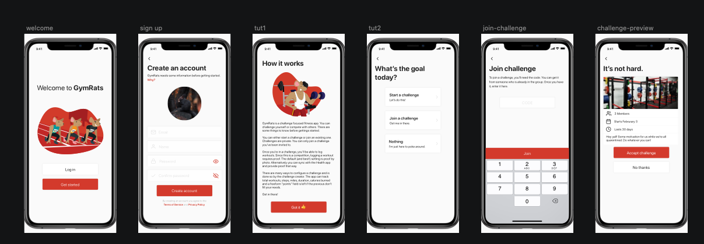
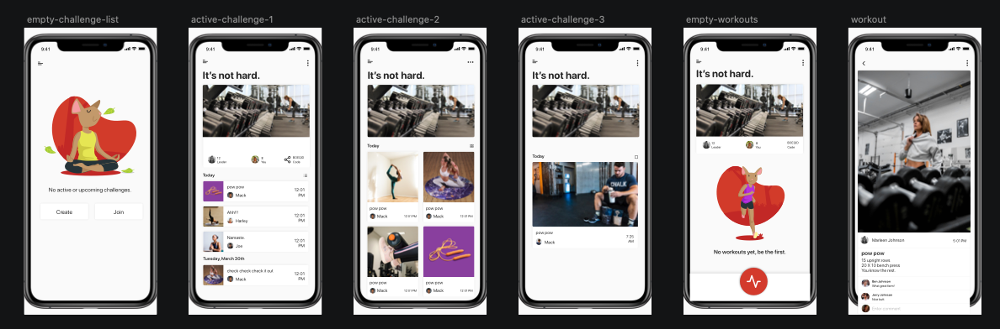
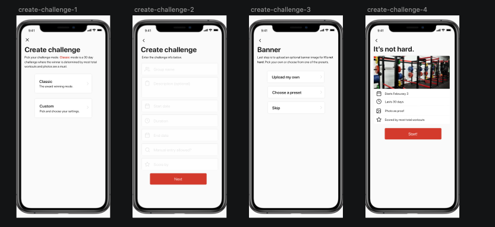
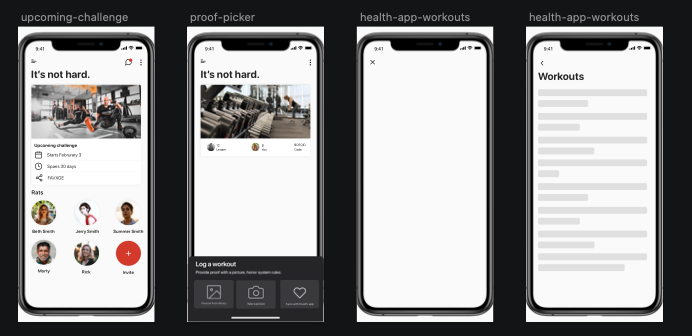
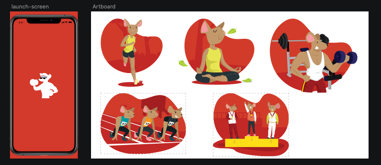
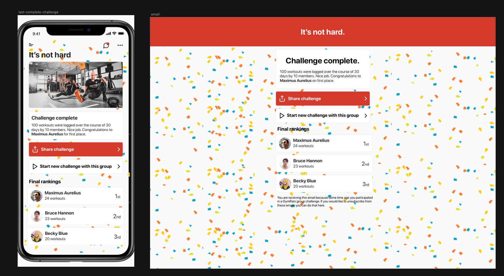
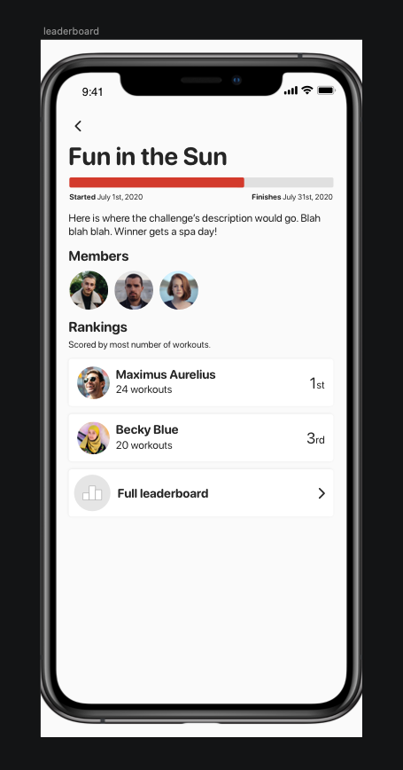
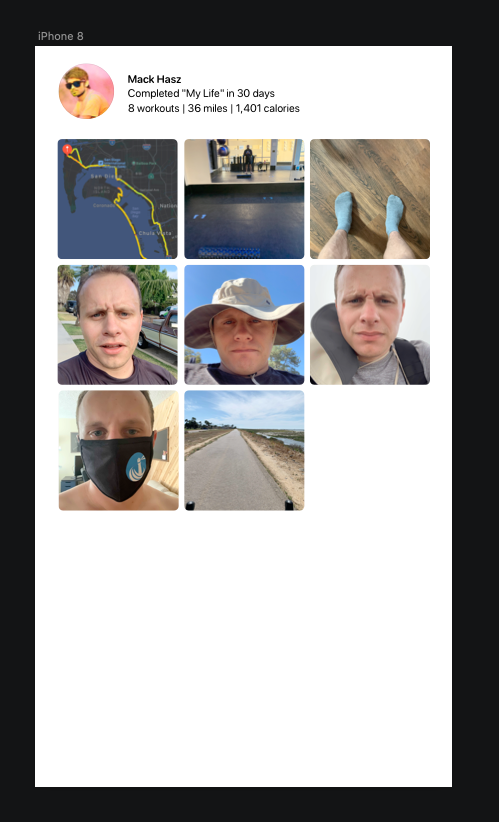
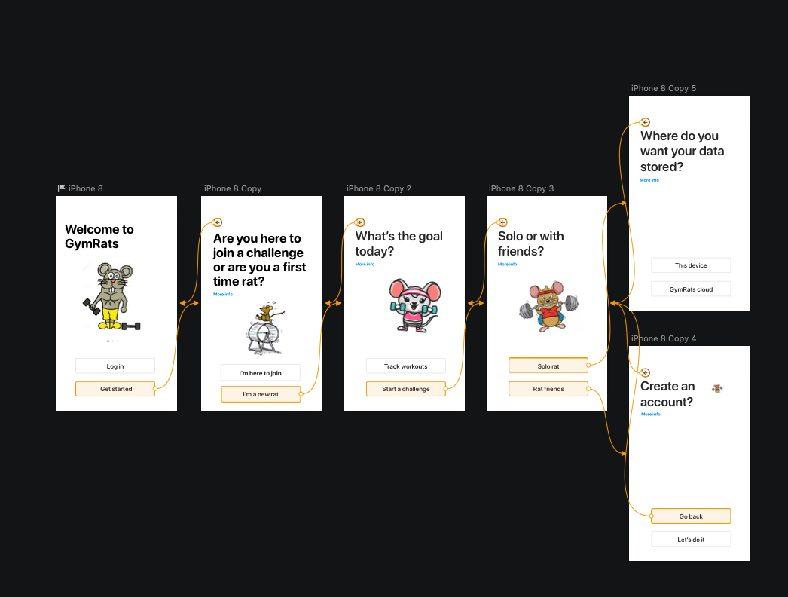
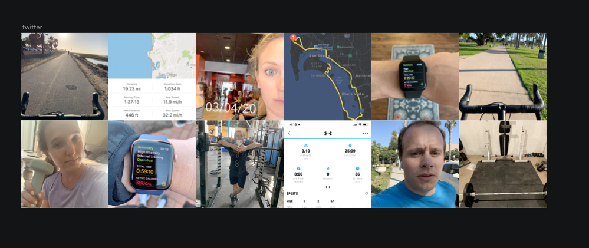
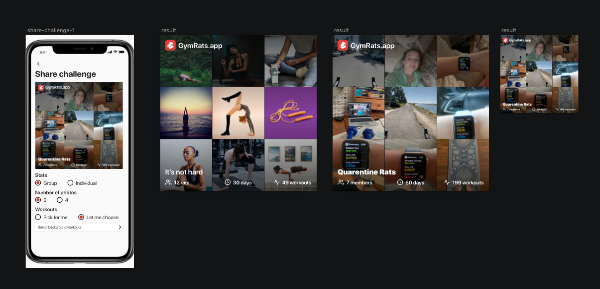
